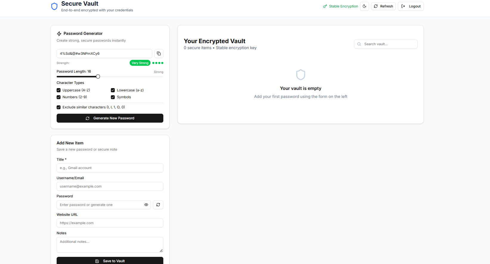

<div align='center'>
<br/>
<h1 align='center'>🔐 Secure Vault - Password Manager</h1>

<br/>


<div>


</div>

</div>

## <a name="introduction">✨ Introduction</a>

A privacy-first, end-to-end encrypted password manager built with Next.js, TypeScript, and MongoDB. Your sensitive data is encrypted client-side before it ever reaches the server.

## <a name="features">🔋 Features</a>

🔒 Security First

 - **Client-Side Encryption** : All data encrypted before sending to server

- **Zero-Knowledge Architecture** : Server only stores encrypted blobs

- **Stable Encryption Keys** : Derived from user credentials (email + password)

- **Secure Clipboard** : Auto-clears copied passwords after 15 seconds

- **No Secrets in Logs** : Comprehensive security practices


## <a name="CoreFunctionality">🎯 Core Functionality</a>


- **Strong Password Generator** : Customizable length and character sets

- **Secure Vault Storage** : Save passwords with titles, usernames, URLs, and notes

- **Full CRUD Operations** : Create, read, update, and delete vault items

- **Real-time Search** : Instant search across all vault items

- **Copy to Clipboard** : One-click copying with security timers


## <a name="UserExperience">🎨 User Experience</a>


- **Dark/Light Mode** : System preference detection with manual toggle

- **Responsive Design** : Works perfectly on desktop and mobile

- **Password Strength Meter** : Visual feedback on generated passwords

- **Loading States** : Smooth user experience with proper feedback

- **Modern UI** : Clean, minimal interface using shadcn/ui components

## <a name="Tech Stack">🛠 Tech Stack</a>

- Frontend

  - Next.js 14 - React framework with App Router

  - TypeScript - Type-safe development

  - Tailwind CSS - Utility-first styling

  - shadcn/ui - Modern component library

  - Lucide React - Beautiful icons

- Backend

  - Next.js API Routes - Full-stack capabilities

  - MongoDB - Database for user and vault storage

  - Mongoose - MongoDB object modeling

  - JWT - Secure authentication tokens

  - bcryptjs - Password hashing

- Security

  - CryptoJS - Client-side AES-256 encryption

  - PBKDF2 - Key derivation from user credentials


## <a name="quick-start">🤸 Quick Start</a>


Installation
Clone the repository

```bash
git clone https://github.com/Amit-yadav099/Password-Generator-Secure-Vault.git

cd password-vault
```

Install dependencies

```bash
npm install
```

Set up environment variables

- Create .env.local in the root directory and add the credentials:

```bash
MONGODB_URI=mongodb://localhost:27017/password-vault
JWT_SECRET=your-super-secret-jwt-key-change-this-in-production
NEXTAUTH_URL=http://localhost:3000
Run the development server
```

Run the Development Server
```bash
npm run dev
```

Open your browser

Navigate to http://localhost:3000


## <a name="securityImplementation">🔐 Security Implementation</a>


Encryption Details
- We use AES-256-CBC encryption with the following approach:

typescript
  - Key derivation from user credentials
```bash
const key = CryptoJS.PBKDF2(password, email,
 {
  keySize: 256 / 32,
  iterations: 100000,
  hasher: CryptoJS.algo.SHA256
}
);
```

Encryption process
```bash
const encrypted = CryptoJS.AES.encrypt(data, key,
  {
  iv: randomIV,
  padding: CryptoJS.pad.Pkcs7,
  mode: CryptoJS.mode.CBC
 }
);
```

## <a name="approach">Why this approach?
</a>

- **Stable Keys** : Encryption keys derived from user credentials remain consistent across sessions

- **Client-Side Only** : Server never sees plaintext data or encryption keys

- **Zero-Knowledge** : We cannot access or recover your encrypted data without your credentials

## <a name="securityFeatures">Security Features
</a>

✅ All sensitive data encrypted before database storage

✅ Passwords hashed with bcrypt (12 rounds)

✅ JWT tokens for secure authentication

✅ Automatic clipboard clearing

✅ HTTPS headers for production

✅ No secrets in client-side bundles


## <a name="Contribution">
🤝 For Contribution
</a>

 - Fork the repository

 - Create a feature branch (git checkout -b feature/amazing-feature)

 - Commit your changes (git commit -m 'Add amazing feature')

 - Push to the branch (git push origin feature/amazing-feature)

- Open a Pull Request

<br>
<br/>

**Final Note** :

🔒 Your Passwords Are Safe With Us 
-  All encryption happens in your browser, ensuring maximum privacy and security.


